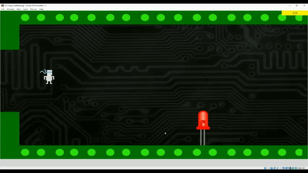

# debugging-ninja
An endless runner / flappy bird game made using tkinter in Python

Runs on 1920 x 1080 screen resolution

Default gameplay settings:
 - esc to escape program
 - space bar to jump
 - return to shoot laser
 - backspace to pause menu (where you can save game if you wish)

